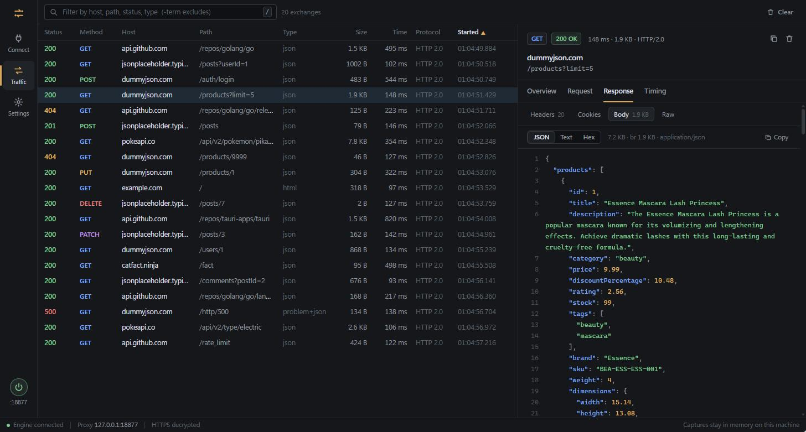
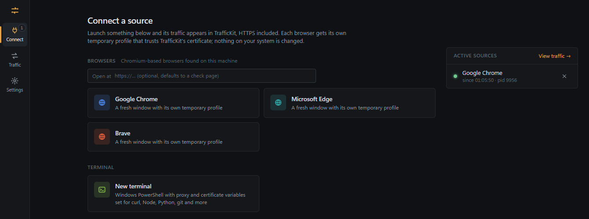

<div align="center">


# TrafficKit

**See every request your apps make. Decrypt HTTPS in one click. Let your AI read it too.**

A free, local HTTP and HTTPS debugging proxy with a fast desktop UI.<br>
No account, no cloud, no paid tier.

[](LICENSE)
[](#install)
[](internal)
[](apps/desktop)
[](docs/user-guide/mcp.md)

[Features](#features) · [Install](#install) · [AI assistants](#use-it-from-your-ai-assistant) · [Docs](#documentation) · [Roadmap](docs/roadmap.md)

<br>



</div>

## Features

| | |
|---|---|
| **One click interception** | Launch Chrome, Edge, Brave, Chromium or Vivaldi in an isolated window that is already routed through TrafficKit, HTTPS included. Or open a terminal where curl, Node, Python and git go through it automatically. |
| **Real HTTPS decryption** | A certificate authority generated on your machine. It is never added to your system trust store; only the windows TrafficKit opens trust it. |
| **Live inspector** | Headers, query, cookies, bodies and timings as they happen. Bodies are decoded (gzip, brotli, zstd) and JSON is formatted with line numbers. |
| **WebSocket inspector** | Every message in both directions, decoded live, including compressed frames. Filter by direction, search payloads, and read JSON messages formatted. |
| **Built for big sessions** | A virtualized table stays smooth with tens of thousands of requests. Filter with plain words, sort any column, move with the keyboard. |
| **AI assistants over MCP** | Claude, Cursor and any MCP client can list, search and inspect your traffic and open intercepted browsers. Passwords, cookies and tokens are redacted before anything leaves your machine. |
| **Clear errors** | DNS failures, refused connections, timeouts and certificate problems come with a plain explanation and a suggested fix. |
| **Private by design** | Everything stays in memory on your machine. No telemetry, no update pings, no sign in. |



## Install

TrafficKit is built from source for now. You need [Go 1.25](https://go.dev/dl/), [Node 20](https://nodejs.org) and, for the desktop app, [Rust](https://rustup.rs) with the [Tauri prerequisites](https://v2.tauri.app/start/prerequisites/).

```sh
git clone https://github.com/kspkr/TrafficKit.git
cd TrafficKit
npm install

# desktop app and installers
cd apps/desktop
npm run tauri:build
```

Installers land in `apps/desktop/src-tauri/target/release/bundle`.

Just want to try it? Run the engine and UI in your browser:

```sh
npm run dev          # UI on http://localhost:5173, proxy on 127.0.0.1:8877
```

Or skip the UI entirely:

```sh
go run ./cmd/traffickit proxy
curl -x http://127.0.0.1:8877 http://example.com/
```

## Use it from your AI assistant

TrafficKit ships a [Model Context Protocol](https://modelcontextprotocol.io) server. With the app running:

```sh
claude mcp add traffickit -- /path/to/traffickit mcp
```

**Settings → AI assistants** shows the exact command for your install, plus the JSON config for Claude Desktop, Cursor and VS Code. Then just ask:

> Open my app's login page in a TrafficKit browser. I'll sign in, you tell me why the request fails.

> Which calls to api.stripe.com errored in the last few minutes, and what did they return?

The assistant can list, search and inspect traffic, read WebSocket messages, wait for a specific request, open and close browsers, and route its own commands through the proxy. The app shows when an assistant is connected. [Tools, redaction and privacy details](docs/user-guide/mcp.md)

## How it works

All networking lives in a Go engine: the proxy, HTTPS interception, capture, the browser and terminal launchers, and the MCP server. It ships as a single binary that doubles as the command line tool.

The desktop app is a thin Tauri shell around a React UI. It starts the engine and talks to it over an authenticated local API, so the UI never touches a socket and the engine never touches pixels. The [architecture notes](docs/architecture/overview.md) go deeper.

## Documentation

| | |
|---|---|
| [Getting started](docs/user-guide/getting-started.md) | Connecting browsers, terminals and devices |
| [AI assistants](docs/user-guide/mcp.md) | MCP setup, tools and redaction |
| [Configuration](docs/configuration.md) | Config file, environment variables, flags |
| [Security model](docs/security/model.md) | What TrafficKit protects and how |
| [Development](docs/development/setup.md) | Building, testing, releasing |
| [Engine API](docs/architecture/ipc.md) | The local API the UI and MCP server use |

## Contributing

Issues and pull requests are welcome. Start with [CONTRIBUTING.md](CONTRIBUTING.md), and report security problems privately as described in [SECURITY.md](SECURITY.md).

## License

[MIT](LICENSE)
